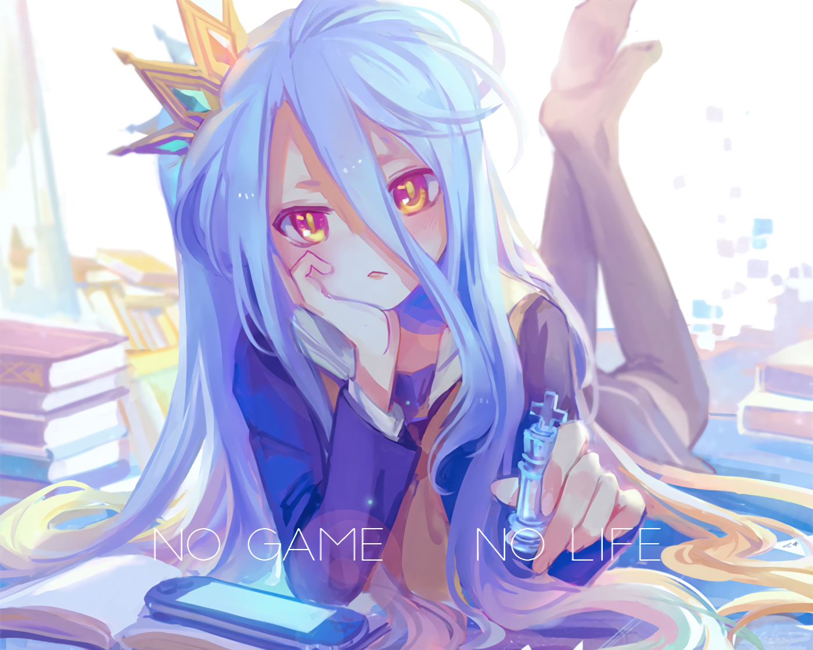

# About

### Welcome to the Shiro Discord Bot

Shiro originally started on the 15th of July in 2019 and gained in a few days a huge userbase. It brings about 10.000 anime openings and endings to every Discord server, and let you and your friends guess them during the song quiz.

Some time ago, there was about a half year of downtime, because the head admin Spinne had no time to maintain the bot anymore. But now this project is back more professional than ever before and so we can't wait for more and more users to come to have a great time with this bot.

### Get the bot here

You can get Shiro for free, just visit [our homepage](https://shiro.pro). There, you will be able to invite and configure the bot through the dashboard. If you need some help, head over to our [Discord support server](https://support.shiro.pro).

### Support the project

If you want to get involved, join our [Discord ](https://support.shiro.pro)and contact Spinne\#3396 if you want to help out:

* moderation of the Discord server
* translation of the bot and website
* designing of new avatars and icons
* finding and fixing bots of our software
* donating a little amount of money

We appreciate any of your help, you are always welcome!

